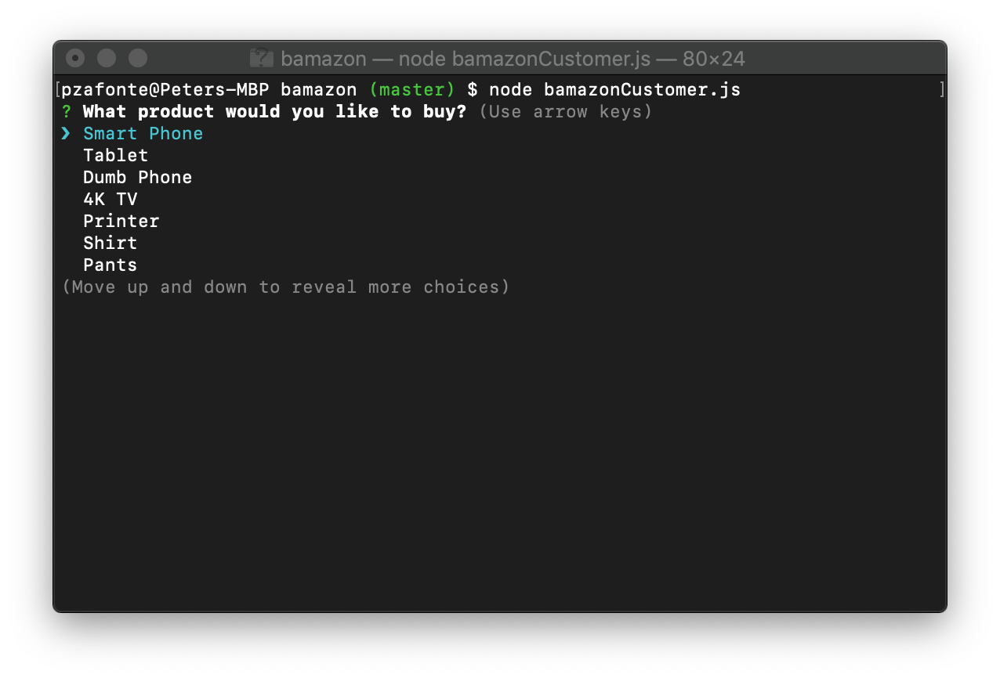
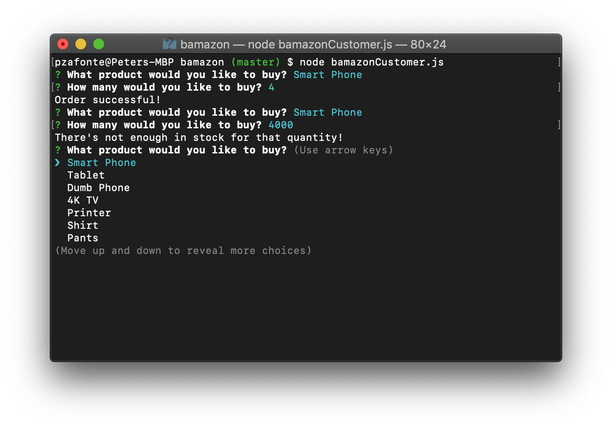
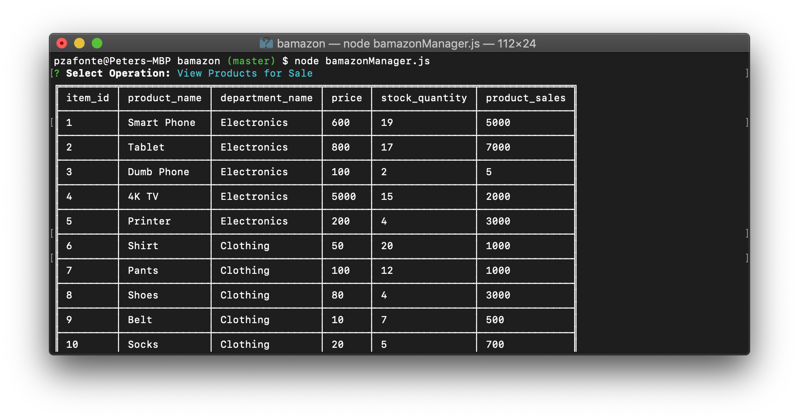
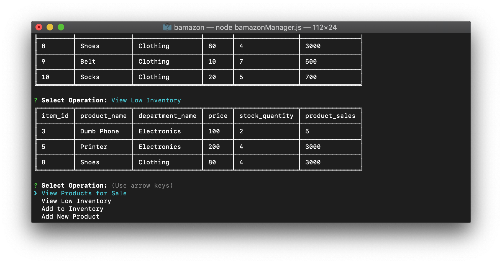
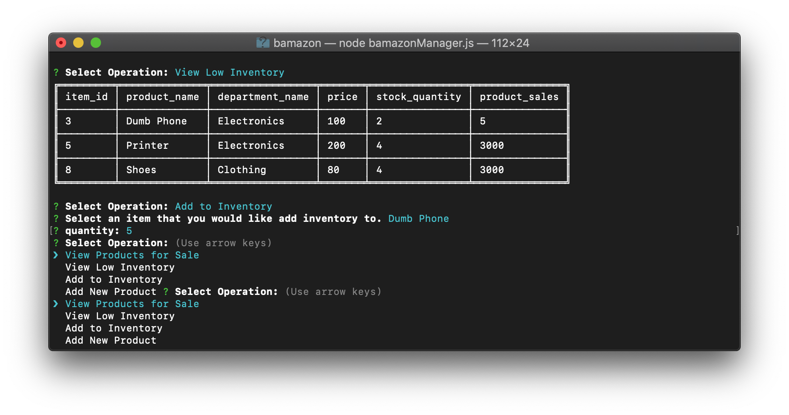

# bamazon
bamazon is a basic amazon-like command line interface that gets product and deparment data and allows various users who would have to interact with it to run the appropriate commands

## Technologies Used
- [x] ES6, Node, MySql

## How to Run
To run bamazon, you will need Bash, [Node](https://nodejs.org/), [npm](https://www.npmjs.com/), and [MySql](https://www.mysql.com/).

1. In Bash, type `git clone git@github.com:pzafonte/bamazon.git` to download bamazon.

2. Then, run the the shema.sql, followed by seeds.sql in your preferred MySQL interface to set up the data base

3. Next, run `node bamazonCustomer.js` to run customer commands and run `node bamazonManager.js` to run manager commands.

## Demo

### bamazonCustomer.js

Type `node bamazonCustomer.js 

### bamazonManager.js

Type `node bamazonManager.js 

